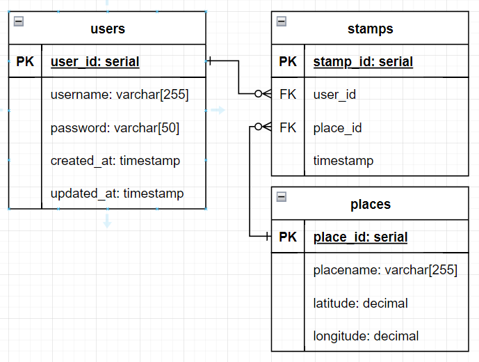

## dockerのインストール
https://www.docker.com/ja-jp/products/docker-desktop/
でwindows版 or mac版 をダウンロードしてインストール

## 始め方
- docker desktopを起動
- power shell か zsh で
```bash
cd ..
docker compose up -d
```

## 止め方
ctrl + c

## ER図

### 解説
- PKは主キー(Primary Key)
    - テーブルにおけるレコードを一意に特定する識別子
- FKは外部キー(Foreign Key)
    - 別テーブルのPK
    - 本テーブルのレコードと別テーブルのレコードを結びつける
        - テーブル結合

## 各データへのアクセス
- 